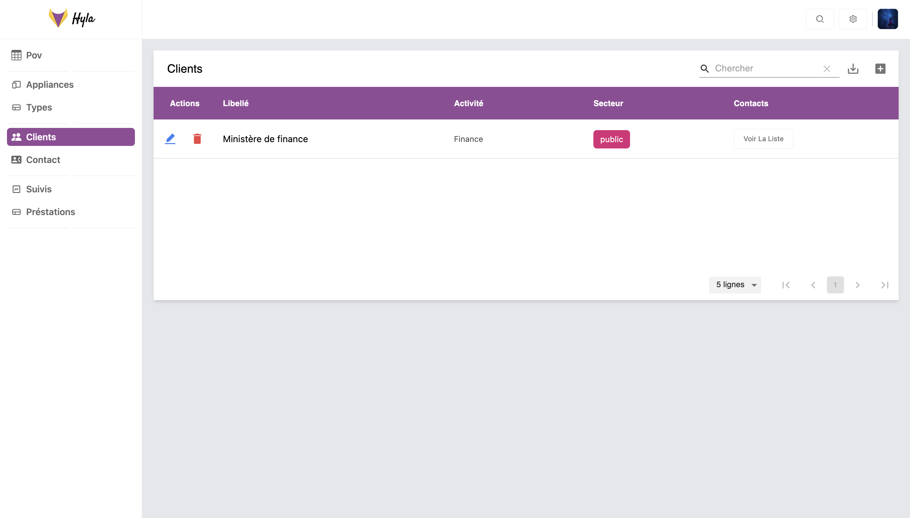
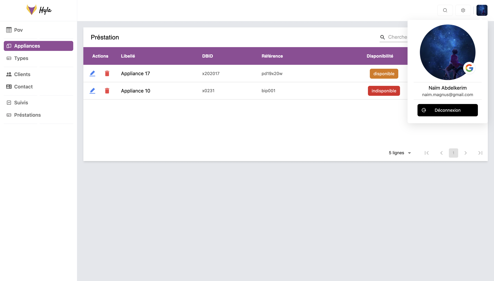

<!--
*** Thanks for checking out the Best-README-Template. If you have a suggestion
*** that would make this better, please fork the repo and create a pull request
*** or simply open an issue with the tag "enhancement".
*** Don't forget to give the project a star!
*** Thanks again! Now go create something AMAZING! :D
-->

<!-- PROJECT SHIELDS -->
<!--
*** I'm using markdown "reference style" links for readability.
*** Reference links are enclosed in brackets [ ] instead of parentheses ( ).
*** See the bottom of this document for the declaration of the reference variables
*** for contributors-url, forks-url, etc. This is an optional, concise syntax you may use.
*** https://www.markdownguide.org/basic-syntax/#reference-style-links
<!-- PROJECT LOGO -->
 

  

<h3 align="center">Hyla | Gestionnaire de POV</h3>

  

     
    <a href="https://github.com/NaimCode/DiplomaHub-DApp"><strong>Explore the docs »</strong></a>
     
     
    <a href="https://github.com/NaimCode/DiplomaHub-DApp">View Demo</a>
    ·
    <a href="https://github.com/NaimCode/DiplomaHub-DApp/issues">Report Bug</a>
    ·
    <a href="https://github.com/NaimCode/DiplomaHub-DApp/issues">Request Feature</a>
  

<!-- TABLE OF CONTENTS -->

<!-- ABOUT THE PROJECT -->
## About The Project

        

           

            
 

(<a href="#top">back to top</a>)

### Built With

* [Next.js](https://reactjs.org/)
* [TRPC](https://trpc.io/)
* [Typescript](https://www.typescriptlang.org/)
* [NextAuth](https://next-auth.js.org/)
* [Prisma](https://www.prisma.io/)
* [TailwindCSS](https://tailwindcss.com/)

(<a href="#top">back to top</a>)

